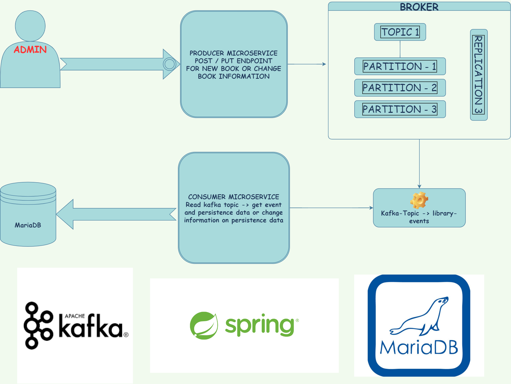

# Library event project with apache kafka -> event driven with microservices architecture

# Diagram

# Technology Stack :

 > Spring Boot

 > Apache Kafka

 > MaribaDB on AWS

 > Integration And Unit Testing

 > Spring Data
 
 
