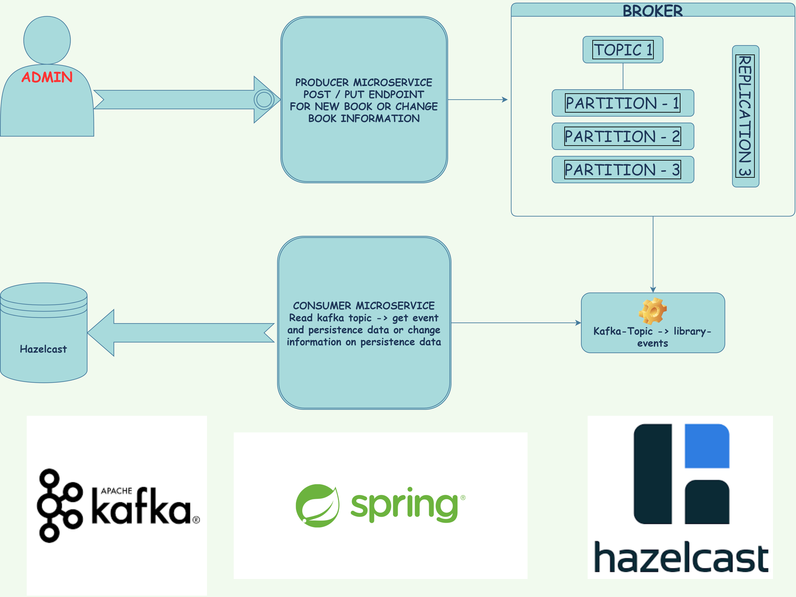

# Library event project with apache kafka -> event driven with microservices architecture

# Producer has been completed. Consumer is deploying... 

# Diagram

# Technology Stack :

 > Spring Boot

 > Apache Kafka

 > Hazelcast

 > Integration And Unit Testing

 > Spring Data

